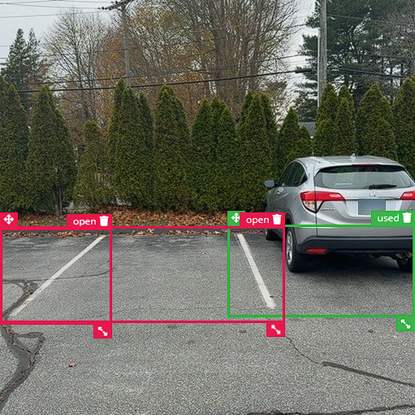
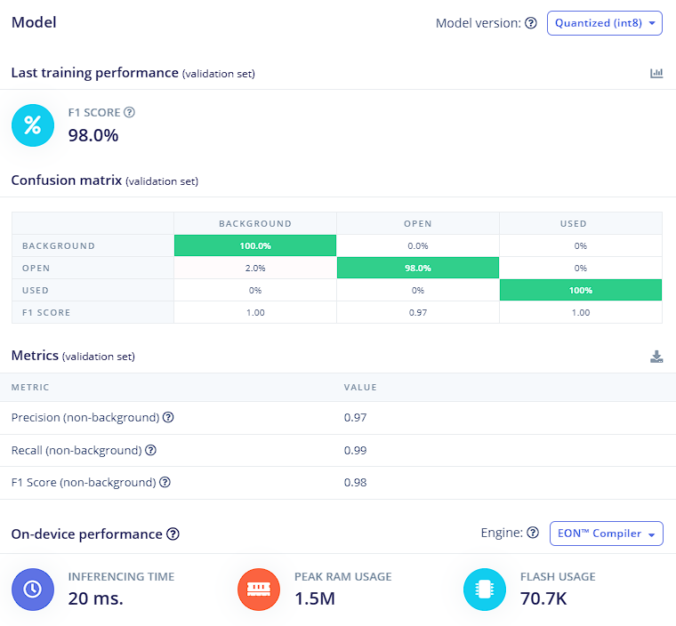
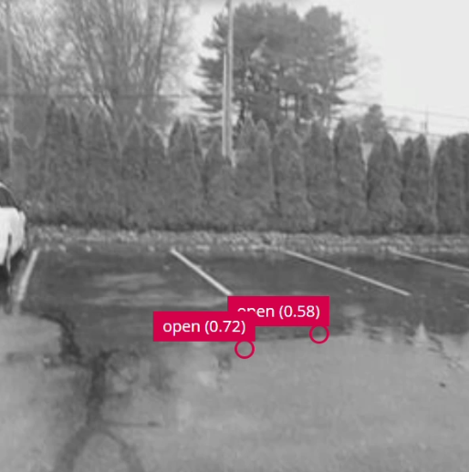

# Edge Impulse Hackathon 2025

## ISpot
Every driver knows the frustration of circling a parking lot, hunting for a spot, only to watch someone else swerve in and steal it. What if you knew exactly where open spots were before you even entered the lot?

iSpot detects open parking spaces in real-time and shows users exactly where and how many spots are available. No more endless loops.

How? We deploy low-cost edge devices—Raspberry Pi cameras running machine learning that detect open spots and relay that data over a mesh network (ClusterDuck Protocol) to a live dashboard. Users see availability before they arrive, and head straight to an open space.

## Development Process

### Data Collection

For this project, the dataset was collected ourselves. The data collection process consisted of driving to a local parking lot and taking images of a car in a spot as well as some surrounding empty spots. 134 images were taken total with 208 instances of open parking spaces and 107 instances of used parking spaces. Ideally these numbers should be closer in value. However, out of respect of not using random people's cars as part of the dataset, just personal vehicles were used. The amount and diversity of data would also ideally be greater than 134 images with 315 objects. However, due to the free tier of Edge Impulse restricting training time to one hour, we felt that getting a lot of simple data would be a great proof of concept.  

The labeling process consisted of drawing the bounding boxes around each parking spot and labeling the box open if there was no car in the spot or used if there was a car there. 

**Example of image used for training:**

### Model Training

Model training started in the `Create Impulse` tab of Edge Impulse. Here the image size was defined at 256x256 pixels and the image processing and object detection blocks were added to the impulse. 

In the `Image` tab, grayscale was chosen for color depth. This was chosen over RGB because for this problem, the image features are going to determine if a parking spot is open or used. The color of the image is useless for this. After saving image parameters and running the feature generator, it is time to start model training. 

Finally, in the `Object Detection` tab, the last parameters and set and model training begins. When training this model, the number of training cycles was 100, the learning rate was 0.001, the CPU was used as the training processor, and data augmentation was enabled.

**Training Results:**

### Application Development

The applicaiton development starts with flashing a version of Raspberry Pi OS to an SD that will be used by our Raspberry Pi. Once the Pi is powered on we SSH into its terminal, we install the [Edge Impulse Linux CLI](https://docs.edgeimpulse.com/tools/clis/edge-impulse-linux-cli#edge-impulse-linux), and downloaded the model to the Raspberry Pi. 

The applicaiton development starts with flashing a version of Raspberry Pi OS to an SD that will be used by our Raspberry Pi. Once the Pi is powered on we SSH into its terminal, we install the [Edge Impulse Linux CLI](https://docs.edgeimpulse.com/tools/clis/edge-impulse-linux-cli#edge-impulse-linux), and downloaded the model to the Raspberry Pi. The Linux CLI will be used to run the model and then pipeline the output into a python file that will parse the output and send the number of open spots to the web app. This is done by using the command: `edge-impulse-linux-runner --model-file hackathon_2025-linux-aarch64-v2.eim | python main.py` 

We incorporated the [ClusterDuck Protocol](https://clusterduckprotocol.org/), an open source LoRa radio protocol that allows IoT devices to communicate with each other. We used a esp32 board called T-Beam to make a MamaDuck and PapaDuck. The MamaDuck relays data in a mesh network. The PapaDuck takes the data from the mesh network and pushes it up to the cloud. For the Papa Duck, it is flashed using Duck Management System (DMS) and for the Mama Duck it is flashed using a custom `.ino` file and PlatformIO.  We also developed a web app using Streamlit. 

Once all the boards are flashed and set up, the complete pipeline is: 
1. The Raspberry Pi will run the Edge Impulse model using the Raspberry Pi Camera.
2. When the Pi detects an open parking spot, it will send a message using UART to the Mama Duck T-Beam that is hardwired to it.
3. The MamaDuck will then send any parking availability using LoRa into the mesh network.
4. The PapaDuck will push any data from the mesh network into the cloud.
5. The Streamlit web app will make an API call that will extract the data and update the page with the latest information.

## Project Demonstration

**Raspberry Pi Inference Example:**

[Video demonstation](https://youtu.be/yrMXqR6eSiM)

## Project Expansions:

A few project expansions that would improve the quality of this project would be:
1. 
